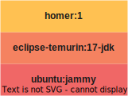

---

styles

color-main: #f06766
color-secondary: #ffc152
color-tertiary: #f58260

---

# Laissez tomber vos Dockerfile, adoptez un buildpack !

---

# Présentation du speaker

---

# Exécuter une application dans un container, c'est facile

# Un Dockerfile 🐋 et hop 🚀

---

# J'écris des (mauvais) Dockerfile depuis 2015

# J'ai vu tout et n'importe quoi

---

# Le 'hello-world' Spring Boot, selon Docker

https://www.docker.com/blog/kickstart-your-spring-boot-application-development/

```Dockerfile
FROM eclipse-temurin:17-jdk-focal
 
WORKDIR /app
 
COPY .mvn/ .mvn
COPY mvnw pom.xml ./
RUN ./mvnw dependency:go-offline
 
COPY src ./src
 
CMD ["./mvnw", "spring-boot:run"]
```

NOTE:
Ok, on voit que ça va fonctionner, mais y'a plein de choses qui ne vont pas
Le spring-boot:run, ça va compiler le code et l'exécuter, c'est à faire en amont
Le code source est présent dans l'image finale!
User root
Comment tu passes des options à ta JVM ?

---

# Le 'hello-world' selon Spring Boot

https://spring.io/guides/topicals/spring-boot-docker/

```Dockerfile
# build stage
FROM eclipse-temurin:17-jdk-alpine as build
WORKDIR /workspace/app

COPY mvnw .
COPY .mvn .mvn
COPY pom.xml .
COPY src src

RUN ./mvnw install -DskipTests
RUN mkdir -p target/dependency && (cd target/dependency; jar -xf ../*.jar)

# run stage
FROM eclipse-temurin:17-jdk-alpine

RUN addgroup -S demo && adduser -S demo -G demo
USER demo

VOLUME /tmp
ARG DEPENDENCY=/workspace/app/target/dependency
COPY --from=build ${DEPENDENCY}/BOOT-INF/lib /app/lib
COPY --from=build ${DEPENDENCY}/META-INF /app/META-INF
COPY --from=build ${DEPENDENCY}/BOOT-INF/classes /app
ENTRYPOINT ["java","-cp","app:app/lib/*","hello.Application"]
```

NOTE:
C'est beaucoup mieux
On est pas root
On a des jolies layers
Le code source n'est plus présent dans l'image finale
Le port n'est pas déclaré (EXPOSE 8080)
Aucun Label / métadata
Comment je paramètre mon appli ? je passe 3000 paramètres derrière mon entrypoint ?
La version du jdk est fixée sur 17, mais 17.0.1 ou 17.0.7 ? => ça dépend de la date à laquelle on a buildé ?
---

# Mais aucun être humain n'est capable d'écrire ça !

---

# Comment font les développeurs ?

Au pire : ils copie/colle un Dockerfile qu'ils ne comprennent pas, d'un tuto random sur internet

Au milieu : ils copie/colle un Dockerfile qu'ils ne comprennent pas, celui de Spring Boot ?

Au mieux : ils sont experts Docker, et améliorent le Dockerfile de Spring Boot

---

# Imaginons qu'on travaille dans une grosse DSI, avec plein de projets

Chaque projet a son Dockerfile, forcément différent.
Comment on assure la cohérence de tout ça ?
Comment on met à jour des versions de Java, des règles de sécurité ?
On ouvre des MR/PR sur les 150 projets de l'entreprise et on espère que les devs mergent rapidement ?

---

 # Est-ce qu'écrire un Dockerfile, c'est le travail d'un développeur ?

---

Adoptez un buildpack !

[](talk-logo.svg)

---

# Mais au fait, c'est quoi une image -Docker- OCI ?

On parle maintenant d'image OCI (Open Container Initiative)

Normalisé : https://github.com/opencontainers/image-spec/blob/main/spec.md

La vision qu'on a souvent :

Les layers



distrib + runtime/middleware + code

---

## La configuration aussi fait partie de l'image OCI !

* architecture / OS
* variables d'environnements
* users
* labels
* commandes / entrypoints
* ports

```json
{
	"architecture": "amd64",
	"config": {
		"Hostname": "",
		"Domainname": "",
		"User": "",
		"AttachStdin": false,
		"AttachStdout": false,
		"AttachStderr": false,
		"Tty": false,
		"OpenStdin": false,
		"StdinOnce": false,
		"Env": [
			"PATH=/opt/java/openjdk/bin:/usr/local/sbin:/usr/local/bin:/usr/sbin:/usr/bin:/sbin:/bin",
			"JAVA_HOME=/opt/java/openjdk",
			"LANG=en_US.UTF-8",
			"LANGUAGE=en_US:en",
			"LC_ALL=en_US.UTF-8",
			"JAVA_VERSION=jdk-17.0.7+7"
		],
		"Cmd": [
			"jshell"
		],
		"Image": "sha256:1dcdc9129900e8da6859de2013f135eb56cc4b67e04ceda95e957b9555c865a2",
		"Volumes": null,
		"WorkingDir": "",
		"Entrypoint": null,
		"OnBuild": null,
		"Labels": {
			"org.opencontainers.image.ref.name": "ubuntu",
			"org.opencontainers.image.version": "22.04"
		}
	},
	"created": "2023-06-02T01:44:46.577735785Z",
	"docker_version": "20.10.23",
	"os": "linux",
	"rootfs": {
		"type": "layers",
		"diff_ids": [
			"sha256:966e94ab6e166fb358a208cfd8169d22dea352501c96700eb7f45092a2962ee6",
			"sha256:c06103114e6ae337714908c1ee4fd815a6d6b364703cbea6050aa10bb82151ec",
			"sha256:e9c496514aa7ec95474908ee8e0f00f1c20756740be194a097111801f77ba29b",
			"sha256:be8cd3ceb782d42ec828a1e53b009d8f70e80c4a5ffa9912ec59349d0a761ce5"
		]
	}
}
```

Et en fait, une image OCI c'est ça : 

```json
{
	"schemaVersion": 2,
	"mediaType": "application/vnd.docker.distribution.manifest.v2+json",
	"config": {
		"mediaType": "application/vnd.docker.container.image.v1+json",
		"size": 6305,
		"digest": "sha256:50440189b0f4cd6264c2f03f92acf4772680d864e3a0d422ef4c463733e139df"
	},
	"layers": [
		{
			"mediaType": "application/vnd.docker.image.rootfs.diff.tar.gzip",
			"size": 30430275,
			"digest": "sha256:d1669123f28121211977ed38e663dca1a397c0c001e5386598b96c89b1b1cd51"
		},
		{
			"mediaType": "application/vnd.docker.image.rootfs.diff.tar.gzip",
			"size": 17038759,
			"digest": "sha256:2ec73b48ae406646223453ca41d5d6b7cb739853fb7a44f15d35a31c238271d2"
		},
		{
			"mediaType": "application/vnd.docker.image.rootfs.diff.tar.gzip",
			"size": 192587566,
			"digest": "sha256:9dbb3ddf83e9096c0e2f32bfa93d16285d2e9586b1a9aa25e33d04cf01d521c7"
		},
		{
			"mediaType": "application/vnd.docker.image.rootfs.diff.tar.gzip",
			"size": 175,
			"digest": "sha256:08d2567dd626029019cc940915699f23b075d05189d99319604fbdae3768fa36"
		}
	]
}
```

Des fichiers `tar.gz`, ayant chacun un digest `sha256`, et une config (avec son digest aussi).

Si on est capable de créer les fichiers `tar.gz`, de calculer un digest `sha256`, on peut créer une image OCI from scratch !

C'est ce que font les buildpacks.

Créer des images OCI, sans avoir besoin de Dockerfile !